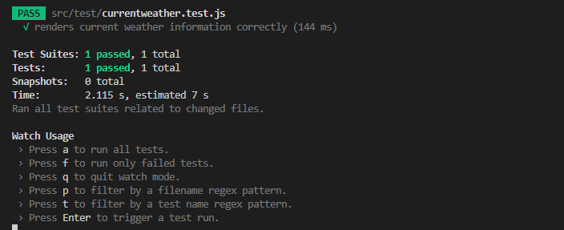
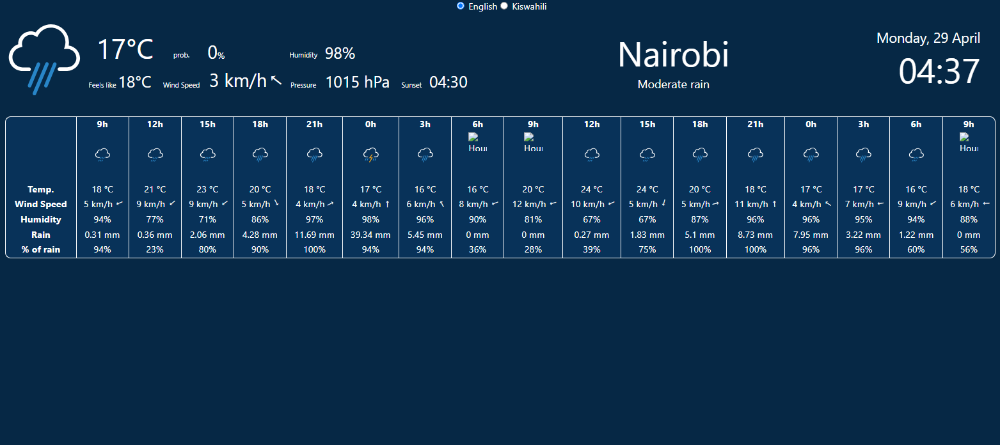
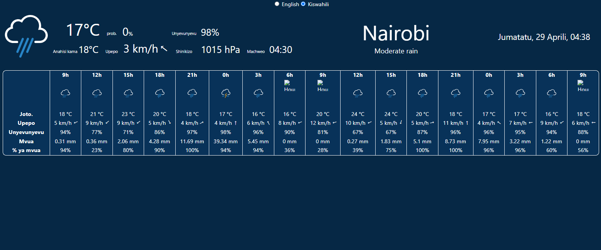

# Multilingual Weather Dashboard
- [Dashboard Demo](https://garesender.esquekenya.com/)


## Features

- Multilingual UI: Supports English and Swahili languages.
- Multi-units - for Celsius and Fahrenheit
- Weather Display: Fetches and displays current weather data from the OpenWeatherMap API for Nairobi.

### Installation

1. Install dependencies:

   ```bash
   npm install
   ```

2. Create a `.env` file in the root directory and add your OpenWeatherMap API key:

   ```
   REACT_APP_API_KEY=your-api-key-here
   ```

   ## Runing Tests - Jest and React testing Library
    ```bash
   npm test
   ```
   

### Usage

1. Start the development server:

   ```bash
   npm start
   ```

2. Open your browser and navigate to `http://localhost:3000` to view the dashboard.

## Built With

- [React](https://reactjs.org/) - JavaScript library for building user interfaces
- [react-intl](https://github.com/formatjs/react-intl) - Internationalize React apps

# The Dashboard.
1.Landing page

## Home


## Home(Kiswahili)


## Authors

- [Vincent Owuor](https://github.com/owuorvin)